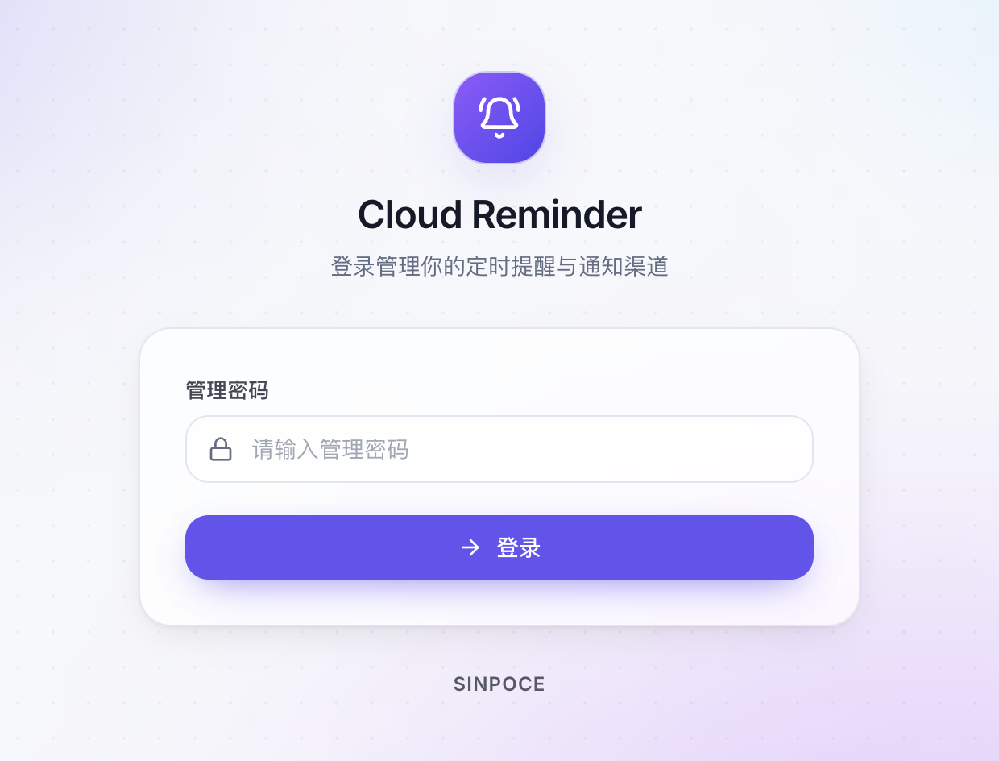
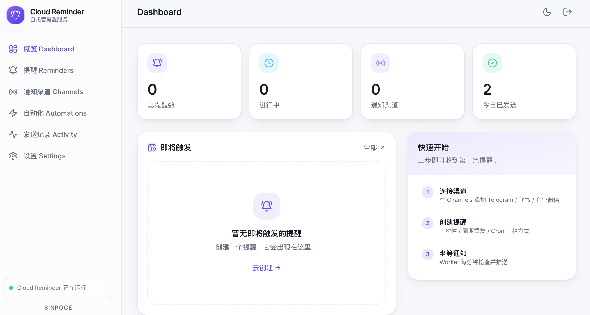
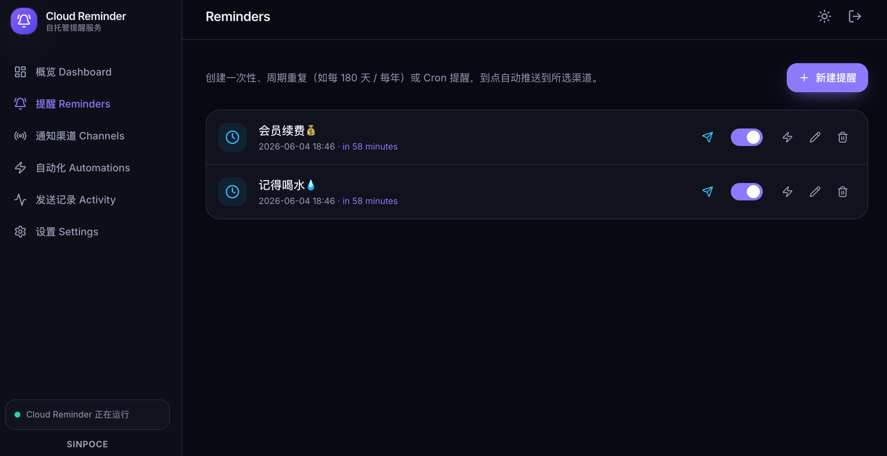
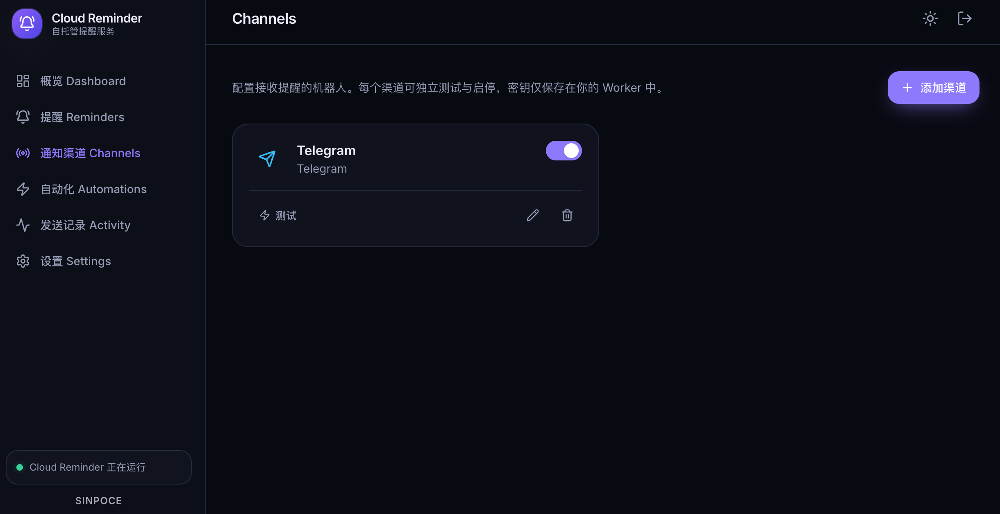

# ☁️ Cloud Reminder · 云端提醒

> **中文**：部署在 **Cloudflare Workers**（+ D1 + Cron）上的自托管提醒服务。接入 **Telegram / 企业微信 / 飞书 / 邮箱 / Webhook**，到点自动推送；内置自动化模块（含 DigitalPlat 域名续订），并支持在浏览器里写自定义代码模块。专业、轻量、全球边缘运行，几乎零成本。
>
> **English**: A self-hosted reminder & automation service running entirely on **Cloudflare Workers** (D1 + Cron). Push to Telegram / WeCom / Feishu / Email / Webhook on schedule; built-in automation modules (incl. DigitalPlat domain renewal) plus in-browser custom code modules. Lightweight, edge-native, near-zero cost — one-click deploy.

<p align="center">
  <a href="https://deploy.workers.cloudflare.com/?url=https://github.com/sinpoce/cloud-reminder">
    
  </a>
</p>

<p align="center">
  <em>单 Worker：API · 每分钟 Cron · D1 数据库 · 内置 React 控制台</em>
</p>

---

## ✨ 功能特性

- 🔔 **三种触发方式** — ①一次性（精确时间点）②**间隔重复**（每 N 分钟/小时/天/周/月/年，如每 180 天、每年）③**定时重复**（可视化选「频率 / 星期 / 时间」，无需手写 Cron）
- 🎛 **自定义提醒周期** — 预设一键选择，或自定义「每 N 个单位」；定时模式提供可视化构建器（高级模式仍可写 Cron 表达式）
- 🧪 **测试发送真实内容** — 编辑提醒时点「测试发送」，立即把你设置的**真实标题/内容**推送到所选渠道，并显示每个渠道的成功/失败原因
- 🌍 **时区感知** — 每条提醒可单独设置 IANA 时区，调度在 Worker 上按时区精确计算（按月/年重复自动处理月末日）
- 🌗 **浅色 / 深色主题** — 默认浅色，一键切换深色，选择本地记忆
- 📡 **多渠道推送** — Telegram、企业微信、飞书（支持签名）、**邮箱（Resend / SMTP）**、**Bark（iOS）**、通用 Webhook；每个渠道可**自定义消息模板**
- 🔌 **渠道连通性测试** — 渠道卡片一键发送测试消息，快速验证 Token / Webhook 是否可用
- 🤖 **自动化模块平台（Automations）** — 按计划运行的边缘任务，**模块化**：内置「DigitalPlat 域名续订」「HTTP 健康检查」；可在**浏览器里写自定义代码模块**（QuickJS WASM 沙箱执行），也可写文件式模块；结果可推送到通知渠道
- 📊 **概览看板 / 发送记录** — 统计、即将触发、每次推送的成功/失败日志
- 🎨 **专业 UI** — 深色 / 浅色主题、玻璃拟态、响应式，桌面与移动端均可用
- 🔐 **单管理员鉴权** — 默认密码 `admin`（零配置即可登录），**登录后请第一时间在「设置」里修改**（PBKDF2 哈希存于 D1）；登录**防暴力破解**（连续错误 10 次锁定 30 分钟）；会话密钥自动生成
- ⚡ **边缘原生** — D1（SQLite）存储，Cron Trigger 每分钟派发，无需自建服务器

> 🔑 **默认登录密码：`admin`** —— 登录后请立刻在「设置 → 修改管理员密码」里改掉（公网可访问）。

---

## 📸 界面预览

| 登录 Login | 概览 Dashboard |
| :---: | :---: |
|  |  |

| 提醒 Reminders | 通知渠道 Channels |
| :---: | :---: |
|  |  |


---

## 🧱 架构

```
                         ┌──────────────────────────────────────────────┐
   浏览器 ──HTTPS/JWT──▶ │            Cloudflare Worker（单一服务）          │
                         │                                              │
                         │  Static Assets  →  React 控制台（web/dist）    │
                         │  Hono API       →  /api/*                     │
                         │  ⏰ Cron "* * * * *"  →  每分钟派发到期提醒/自动化 │
                         │                          │                   │
                         │   ┌──────────────┬───────┼───────┬─────────┐ │
                         │   ▼              ▼       ▼       ▼         ▼ │
                         │ Telegram      企业微信   飞书    邮箱     Webhook│
                         │                          │                   │
                         │                          ▼                   │
                         │                 D1 (SQLite) reminders/...     │
                         └──────────────────────────────────────────────┘
```

**一个 Worker 搞定全部**：用 Workers Static Assets 托管前端、Hono 处理 API、Cron 每分钟派发。前端与 API 同源，无需 CORS。（本地开发时前后端分开跑，见下文。）

---

## 📁 目录结构

```
cloud-reminder/
├── wrangler.jsonc          # 统一部署配置（Worker + Static Assets + D1 + Cron），一键按钮用
├── worker/                 # Cloudflare Worker：API + Cron + 渠道 + 自动化
│   ├── src/
│   │   ├── index.ts        # Hono 应用 + scheduled() + 静态资源回退
│   │   ├── auth.ts         # JWT、密码哈希、鉴权中间件
│   │   ├── db.ts / db-init.ts   # D1 数据访问 / 首次自动建表
│   │   ├── schedule.ts     # 时区感知的 Cron / interval 计算
│   │   ├── channels/       # telegram / wechat / feishu / email / webhook
│   │   ├── automations/    # 模块平台（digitalplat / httpcheck / 自定义代码沙箱）
│   │   └── routes/         # reminders / channels / automations / settings / meta
│   ├── schema.sql · migrations/
│   └── wrangler.toml       # 仅本地开发 / 单 Worker-API 用
└── web/                    # React + Vite + Tailwind 控制台（构建产物由 Worker 托管）
    └── src/{pages,components,lib}
```

---

## 🚀 部署

有两种方式：**A. 一键部署（最简单）** 或 **B. 手动部署**。

### 方式 A · 一键部署到 Cloudflare（推荐）

[](https://deploy.workers.cloudflare.com/?url=https://github.com/sinpoce/cloud-reminder)

点上面的按钮，Cloudflare 会把本仓库**复制一份到你的 GitHub 账户**（一个独立仓库 —— 注意它是**内容副本，不是 fork**）→ 自动**创建 D1 数据库**并构建前端 → 部署为**一个 Worker**（同时托管控制台、API 与每分钟 Cron）。数据库表会在首次访问时**自动创建**，无需手动迁移。

> 🔄 **后续如何更新**：因为是独立副本（非 fork），主仓库发布新版本时**不会自动同步**过来。更新步骤见下方 **「🔄 更新到最新版本」**；想要"以后在网页上一键更新"，可改用其中的 **Fork 方式**搭建。

**零配置即可用**：默认登录密码是 **`admin`**，会话密钥（JWT）首次运行时自动生成并存入 D1 —— 无需设置任何 Secret 就能登录。

> ⚠️ **务必首次登录后立刻在「设置」里改密码！** 默认 `admin` 仅为开箱即用，公网可访问。
> 如需自定义，可在 Worker → Settings → Variables 设置可选 Secret：`ADMIN_PASSWORD`（覆盖默认密码）、`JWT_SECRET`（覆盖自动生成的会话密钥）。

> 这一键方案把前端以 **Workers Static Assets** 形式与 Worker 打包在一起（同源，无需配置 CORS / API 地址）。原理见根目录 [`wrangler.jsonc`](wrangler.jsonc)。

---

### 方式 B · 手动部署（单 Worker，效果与一键相同）

前置要求：

- 一个 [Cloudflare 账号](https://dash.cloudflare.com/sign-up)（免费版即可）
- 本机已装 **Node 18+**
- 安装并登录 Wrangler：`npm i -g wrangler` 然后 `wrangler login`（浏览器授权，无需 API Token）

在**仓库根目录**执行：

```bash
# 1) 创建 D1 数据库，把返回的 database_id 填进根目录 wrangler.jsonc 的 d1_databases
wrangler d1 create cloud_reminder

# 2) 安装依赖并部署（自动构建前端 + 部署「统一 Worker」：控制台 + API + 每分钟 Cron）
npm --prefix worker install && npm --prefix web install
wrangler deploy            # 使用根目录 wrangler.jsonc

# 3)（可选）覆盖默认密码 / 会话密钥；不设也能用（默认密码 admin，JWT 自动生成）
wrangler secret put ADMIN_PASSWORD
wrangler secret put JWT_SECRET
```

部署后打开 Worker 地址 `https://cloud-reminder.<你的子域>.workers.dev`：

- 数据库表**首次访问自动创建**，无需迁移；
- 用默认密码 **`admin`** 登录，然后在「设置」里**尽快改密码**。

> 前端以 **Workers Static Assets** 与 Worker 同源打包 —— 无需单独部署 Pages、也无需配置 CORS / API 地址。Cron（`* * * * *`）已在 `wrangler.jsonc` 中配置。

---

## 🔌 配置通知渠道

登录后进入 **通知渠道 Channels → 添加渠道**，按类型填写：

### Telegram
1. 给 [@BotFather](https://t.me/BotFather) 发送 `/newbot`，拿到 **Bot Token**。
2. 给你的机器人发一条消息，然后访问
   `https://api.telegram.org/bot<token>/getUpdates`，在返回里找到 `chat.id`。
3. 填入 **Bot Token** 与 **Chat ID**。

### 企业微信（WeCom）
1. 在企业微信群里「**添加群机器人**」。
2. 复制它的 **Webhook 地址**，粘贴到「Webhook URL」。

### 飞书 / Feishu
1. 飞书群「**设置 → 群机器人 → 添加自定义机器人**」。
2. 复制 **Webhook 地址**；若开启了「签名校验」，把密钥填入 **Signing Secret**。

### 邮箱 / Email（Resend 或 SMTP）
在「发送方式」里二选一：
- **Resend API**（最简单）：在 [resend.com](https://resend.com) 创建 **API Key**；发件人需为已验证域名，测试可用 `onboarding@resend.dev`。
- **SMTP**：填你邮箱的 SMTP 服务器，如 QQ `smtp.qq.com:465`、Gmail `smtp.gmail.com:465`、163 `smtp.163.com:465`；**密码填「授权码 / 应用专用密码」**（不是登录密码）。端口 **465 走 SSL、587 走 STARTTLS**（Cloudflare Workers 不支持 25 端口）。

> 📧 邮件正文用**内置带 SINPOCE 品牌的 HTML 模板**（卡片式，含事件 / 内容 / 时间），可在渠道「邮件模板」里自行修改；占位符 `{{title}} {{body}} {{time}}`。

### Bark（iOS 推送）
1. 安装 iOS App **Bark**，把它「您的推送地址」整条（如 `https://api.day.app/xxxxxx`）**直接粘贴**到 **Bark 推送地址 / Device Key**，会自动识别服务器与 Device Key。
2. 也可只填地址末尾的 Device Key；自建 Bark 服务器同样支持，可选填提示音、分组。

### 通用 Webhook
向你的 URL `POST` 一段 JSON：`{ "title", "body", "timestamp" }`。
可对接 Discord、Slack、n8n、自建服务等。

> 添加后点击卡片上的「**测试**」即可立即验证连通性。
>
> 💬 **消息模板**：每个渠道都有内置默认模板 `🔔 {{title}}` / `{{body}}` / `🕐 {{time}}`（含事件、内容、时间），可在渠道里自行修改；清空则回退到内置默认。占位符：`{{title}}` 标题、`{{body}}` 内容、`{{time}}` 触发时间（按提醒时区）。

---

## 🕒 提醒与调度是怎么工作的

- 所有时间在数据库中以 **UTC 秒**存储；每条提醒带自己的 IANA 时区。
- Worker 的 `scheduled()` 每分钟触发一次：
  1. 查询 `enabled = 1 且 next_run <= now` 的提醒；
  2. 并发发送到该提醒选择的所有渠道，并写入 `deliveries` 日志；
  3. **一次性**提醒发送后结束（`next_run = NULL`）；**周期 / Cron** 提醒按时区重新计算下次触发时间。

### 自定义提醒周期规则

**① 周期重复（interval）** — 最直观的「每隔多久一次」：

- 从你设置的**开始时间**起，每隔「`N` × `单位`」触发一次；单位支持 **分钟 / 小时 / 天 / 周 / 月 / 年**，`N` 为正整数。
- 预设：每天、每周、每两周、每月、每季度、**每 180 天**、每半年、**每年**；也可在「自定义间隔」里填任意数值，例如 `每 45 天`、`每 3 个月`、`每 2 年`。
- 触发时刻对齐到**整分钟**（Cron 每分钟检查）。
- 「天 / 周」按所选时区保持**本地钟点**不变（跨夏令时也不漂移）。
- 「月 / 年」按日历推进：若开始日为 **29–31 号**，遇到天数不足的月份会自动取**该月最后一天**（如 1/31 → 2/28、6/30）。

**② 定时重复（按日历）** — 适合「每天 / 每周几 / 每月几号」的日历规则，**默认用可视化构建器，无需手写表达式**：

- 选「频率（每天 / 每周 / 每月）」+「星期（可多选）/ 日期」+「时间」即可，界面实时显示人话描述，如 `工作日 09:00`、`每周一、三 20:00`、`每月 1 号 09:00`。
- 需要更复杂规则时点「**切换到 Cron 表达式（高级）**」手写 5 段 Cron：`分 时 日 月 周`，支持 `*`（任意）`,`（列举）`-`（范围）`/`（步进）；例 `*/30 * * * *`＝每 30 分钟。星期 `0` / `7` 均表示周日。

> 经验法则：**固定间隔**（每 N 天/月/年）用「间隔重复」；**日历对齐**（星期几、每月几号）用「定时重复」。

### 🧪 测试发送

编辑提醒时点击「**测试发送**」，会立刻把你填写的**真实标题与内容**推送到所选渠道（无需先保存），并按渠道返回成功/失败与原因，便于联调。提醒列表里的 ⚡ 按钮同样会发送真实内容。

---

## 🤖 自动化（模块化）

「**自动化**」是一个**模块平台**：每个能力是一个**模块**（module），用户创建模块的**计划实例**并按 Cron 在边缘运行。内置两个开箱即用的模块：

| 模块 | 说明 |
| --- | --- |
| **DigitalPlat 域名续订** | 到期前（剩余少于 120 天）自动调用 DigitalPlat API 免费续订域名 1 年 |
| **HTTP 健康检查** | 定时请求一个 URL，状态码异常 / 超时 / 关键字缺失即判为异常（可推送告警） |

每个自动化实例 = 选定模块 + 表单配置 + 运行计划（可视化 Cron）+ 结果通知渠道。运行写入「运行记录」，有结果/失败时通过所选渠道通知你；模块的敏感字段（如 Token）只以脱敏形式回显。

### ✍️ A. 在浏览器里写自定义模块（无需部署）

面向有编程能力的用户：新建自动化 → 选「**自定义代码**」→ 在代码编辑器里写 JS，保存即用。

- 运行在 **QuickJS（编译为 WASM）沙箱**里——Workers 禁止 `eval`/运行时编译 WASM，而 QuickJS 引擎在构建时编译、运行时*解释*你的 JS 字符串，既可行又被沙箱隔离。
- 沙箱内可用：`config`（你填的配置）、`console.log()`、`await fetchJson/fetchText/httpRequest(url, opts)`、`await sleep(ms)`。
- 返回 `{ status, summary, items:[{item,action,detail}] }` 或字符串。
- 限制：单次运行 ≤15 秒（防死循环）、64MB 内存；只能通过上述 API 访问外部。键名含 `token/secret/key/password` 的配置值会脱敏保存。

```js
// 示例：监控 GitHub 仓库 star 数
const repo = await fetchJson("https://api.github.com/repos/" + config.repo);
return {
  status: "success",
  summary: config.repo + " ★ " + repo.stargazers_count,
  items: [{ item: config.repo, action: "ok", detail: "stars " + repo.stargazers_count }],
};
```

> ⚙️ QuickJS 引擎以 WASM 形式随 Worker 一起部署（已 vendored 到 `worker/src/automations/quickjs.wasm`，约 0.5MB）。升级 quickjs-emscripten 后用 `npm run vendor:wasm` 重新拷贝。

### ✍️ B. 文件式模块（内置模块的写法，类型安全）

1. 复制 [`worker/src/automations/modules/TEMPLATE.ts`](worker/src/automations/modules/TEMPLATE.ts) 为 `my-module.ts`。
2. 实现接口（`key` / `label` / `fields` / `run`，可选 `test`）：
   ```ts
   const myModule: AutomationModule = {
     key: "my_module",
     label: "我的模块",
     description: "…",
     fields: [{ key: "api_key", label: "API Key", required: true, secret: true }],
     async run(ctx) {
       // ctx.config 是用户填的表单值；ctx.log() 记录日志
       const res = await fetch("https://api.example.com", {
         headers: { Authorization: `Bearer ${ctx.config.api_key}` },
       });
       return { status: res.ok ? "success" : "failed", summary: `HTTP ${res.status}`, items: [] };
     },
   };
   export default myModule;
   ```
3. 在 [`worker/src/automations/registry.ts`](worker/src/automations/registry.ts) 里 import 并注册它。
4. `npm run deploy` —— 新模块会自动出现在「自动化 → 新建自动化」的模块选择里。

`fields` 声明的表单会被控制台自动渲染（含 `secret` 脱敏、`number`/`textarea` 类型），无需改前端。

### DigitalPlat 域名续订 · 使用与注意

1. 在 [dash.domain.digitalplat.org/dashboard/api/keys](https://dash.domain.digitalplat.org/dashboard/api/keys) 创建 API Token（形如 `dp_live_…`）。
2. 新建自动化 → 选「DigitalPlat 域名续订」→ 填 Token、提前续订天数（默认 **120**）、运行计划（建议**每天**）。
3. 卡片上「测试连接」验证 Token，「立即运行」按窗口逻辑跑一次。

> 📌 **续订窗口（重要）**：DigitalPlat 免费续费**仅在「剩余少于 120 天」时开放**，窗口外调用会被服务端拒绝（500）。所以默认到期前 **120 天内**才续；未进入窗口的域名显示「还有 X 天到期，未进入续订窗口」。设为**每天运行**即可，窗口一开自动续 1 年。

> ⚠️ **Cloudflare 风控**：DigitalPlat 的 API 站点开了 Cloudflare Bot 拦截，本模块带**浏览器 UA + 客户端提示头**通过其（基于 UA 的）挑战——已在 Worker 实测拿到正常 JSON。若日后收紧导致被挑战，会**优雅报错**而非静默失败。

### 🌗 主题

控制台默认 **浅色模式**，右上角点击即可切换 **深色模式**，选择会记忆在浏览器本地（`localStorage`）。

---

## 🔄 更新到最新版本

更新分两件事：**① 更新代码**（拿到新功能）和 **② 数据库迁移**（仅当新版新增了表 / 字段时）。

> ✅ 本次「**Bark 渠道 + 内置消息模板**」更新**只需更新代码，无需迁移**（模板与 Bark 配置都存在渠道的 `config` 里，不涉及新表/字段）。

### ① 更新代码

原理：**让 Cloudflare 连接的那个仓库拿到最新代码，它就会自动重新构建并上线。** 按你的部署方式选一种 👇

#### 方式 A · 你用「一键部署」按钮搭的（独立副本仓库）

一键部署在你账户下创建了一个**独立副本仓库**（名字形如 `cloud-reminder-xxxx`），Cloudflare 连着它自动构建。它**不是 fork**，用不了 GitHub 的「Sync fork」，用命令行把官方最新代码同步过去即可：

```bash
# 把 <你的用户名>/<你的副本仓库> 换成你账户里那个仓库
git clone https://github.com/<你的用户名>/<你的副本仓库>.git
cd <你的副本仓库>
git remote add upstream https://github.com/sinpoce/cloud-reminder.git
git fetch upstream
git reset --hard upstream/main      # 用官方最新版覆盖（你没改过仓库代码时最干净、安全）
git push --force origin main        # 推送后 Cloudflare 自动重新构建并上线（约 1–3 分钟）
```

> 你的渠道 / 提醒数据都存在 Cloudflare 的 **D1** 里，**只更新代码不会动数据**。
> 如果你在仓库里改过代码（如加了自定义模块），把 `reset --hard` 换成 `git merge upstream/main` 并手动处理冲突。

#### 方式 B · 想要"以后在网页上一键更新"？改用 Fork 搭建（推荐）

如果你还没搭、或愿意重搭一次，用 **Fork** 是最省心的：以后更新只需在网页上点一下，无需命令行。

1. 点本仓库右上角 **Fork**，复刻到你的账户（这是**真正的 fork**，与上游有关联）。
2. Cloudflare Dashboard → **Workers & Pages → Create → Workers → Connect to Git**，选你刚 fork 的仓库；Cloudflare 会读取根目录 [`wrangler.jsonc`](wrangler.jsonc)，自动创建 D1、设置每分钟 Cron 与构建命令。
3. 以后官方发布新版时，打开你的 fork 页面 → 点 **「Sync fork」→ Update branch**；Cloudflare 检测到这次更新会**自动重新部署**。全程网页操作。

#### 方式 C · 你用本地 `wrangler deploy` 部署的

```bash
git pull                                          # 拉取官方最新代码
npm --prefix worker install && npm --prefix web install
wrangler deploy                                   # 重新构建并部署
```

### ② 数据库迁移（仅新版新增表 / 字段时）

**全新部署无需操作**（`schema.sql` 已最新，表会在首次访问时自动创建）。若你从更老的版本升级，按需对线上库执行迁移：

```bash
cd worker
wrangler d1 execute cloud_reminder --remote --file=./migrations/0001_add_interval.sql       # interval 周期重复
wrangler d1 execute cloud_reminder --remote --file=./migrations/0002_add_automations.sql    # automations 自动化
wrangler d1 execute cloud_reminder --remote --file=./migrations/0003_add_custom_modules.sql # 自定义代码模块
wrangler d1 execute cloud_reminder --remote --file=./migrations/0004_add_settings.sql       # 设置（改密码 / 默认时区）
```

> 这些迁移都是幂等的（`IF NOT EXISTS`），重复执行安全。

---

## 💻 本地开发

```bash
# 终端 A — 启动 Worker（含本地 D1，表会自动创建）
cd worker
cp .dev.vars.example .dev.vars     # 可选：本地的 ADMIN_PASSWORD / JWT_SECRET
npm install
npm run dev                        # http://localhost:8787

# 终端 B — 启动控制台
cd web
npm install
npm run dev                        # http://localhost:5173 （/api 自动代理到 8787）
```

打开 http://localhost:5173 ，用密码 **`admin`** 登录（或 `.dev.vars` 里设的密码）。本地开发前后端分开跑；生产是同一个 Worker 一起部署。

> 想本地验证 Cron 派发？运行
> `curl "http://localhost:8787/cdn-cgi/handler/scheduled"` 手动触发一次调度。

---

## 🔐 安全说明

- **默认密码是 `admin`**，部署后**请第一时间在「设置」里修改**（改后以 PBKDF2 哈希存入 D1，明文不落库）。会话 JWT 密钥首次运行自动生成并存于 D1，也可用 `ADMIN_PASSWORD` / `JWT_SECRET` 两个 Secret 覆盖。
- 渠道里的 Token / Webhook、自定义模块里的密钥等敏感字段保存在你自己的 D1 中，读取接口会做**脱敏**返回。
- 统一部署下控制台与 API **同源**，不涉及跨域；`ALLOWED_ORIGINS="*"` 因此是安全的（仅当你把前端拆到别的域名时才需收紧）。
- 自定义代码模块运行在 **QuickJS WASM 沙箱**里（15 秒/64MB 上限、仅能用受限 API），且只有你自己能创建——单管理员模型，适合个人 / 小团队自托管。


<p align="center"><sub>Built for the edge · 单个 Cloudflare Worker（Static Assets + D1 + Cron）</sub></p>
<p align="center"><b>SINPOCE</b></p>
